# Proskiro — System Overview

**Proskiro is a career-intelligence platform.** It takes the messy, standards-based world of
occupation data (the European **ESCO** taxonomy and the US **O\*NET** taxonomy) and turns it into
something a real person can use: for any of thousands of jobs, it shows the skills that matter,
ranks them by importance, and recommends genuinely relevant books and learning resources for each one.

The product is built as a small **monorepo of focused services** rather than one large application.
Each piece does one job well, and they share a single source of truth. This document explains what
each project is and — more importantly — **how they work together**.

> Each sub-project has its own detailed `README`. This page is the map that sits above them.

---

## The big picture

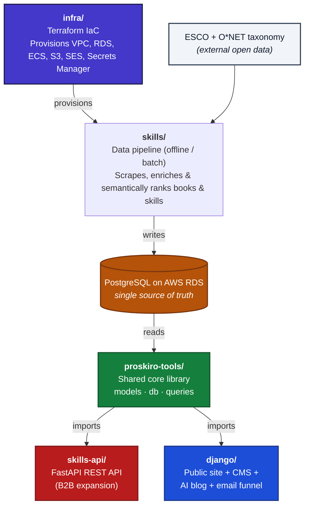

The key design decision: **one database, one shared data layer, many consumers.** The data pipeline
writes; the web app and API read. Neither the API nor the website re-implements how a "profession"
or a "skill" is shaped — that lives once in `proskiro-tools` and everything imports it. Underneath
all of it, `infra` provisions and wires together the actual AWS services every other project depends
on to run.

---

## The projects

### 1. `proskiro-tools/` — the shared core
The library that keeps everything consistent. It defines the **data models** (professions, skills,
books, and their metadata), the **database connection layer** (SQLAlchemy with SSL, connection
pooling, and resilience for cloud databases), and the **queries** used to search and fetch data.

Both the website and the API depend on it, so they can never drift out of sync — a change to what a
"profession" means happens in exactly one place.

*Tech: Python, Pydantic v2, SQLAlchemy 2.0, PostgreSQL.*

### 2. `skills/` — the data pipeline
The engine that builds the dataset. For every skill in the platform it queries multiple book APIs
(Google Books, Open Library), filters out low-quality results, and then uses **semantic AI**
(Cohere's rerank model) to surface books that are genuinely relevant to the skill rather than just
keyword matches. It also aligns the European (ESCO) and US (O\*NET) job taxonomies using AI
embeddings so job titles can be enriched across both standards.

This is the "hard data" behind the product, and it runs as a containerised batch job on an automated
schedule, so the dataset keeps itself current without manual intervention.

*Tech: Scrapy, Cohere (rerank + embeddings), Google Books / Open Library APIs, PostgreSQL, Podman.*

<p align="center">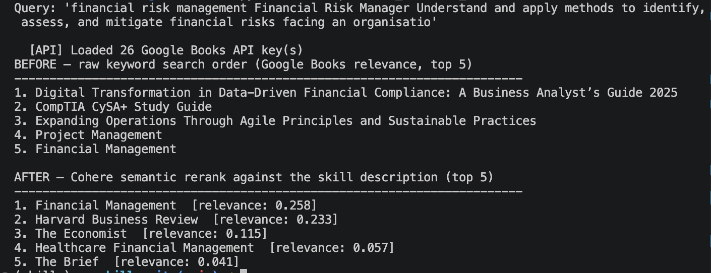</p>
<p align="center"><em>Semantic reranking in action — raw keyword matches (left) vs. the AI-reranked, genuinely
relevant results actually shown to users (right).</em></p>

<details>
<summary><strong>Sample pipeline run</strong> (real dry-run against production data, click to expand)</summary>

```
Proskiro skills pipeline — sample run (dry-run, no DB writes)
Command: python -m my_services.search_books_for_skills --max-pairs=8 --featured-only --force-refresh --dry-run

============================================================
Skill: hand gestures & signals  (for Notary)
============================================================
  Query: hand gestures signals notary — The meanings of different hand gestures...
  google_books: 3 books after hard filters
    Dictionary of Gestures                              relevance: 0.69
    Hand Gesture Recognition for Dumb and Blind          relevance: 0.00
    Greeting by Gesture and the Gesture-Language         relevance: 0.00
  [RELEVANCE] Filtered to 1 book (score >= 0.3)
  ✔ Matched: "Dictionary of Gestures" (2023)

============================================================
Skill: communication & correspondence  (for Patent Engineer)
============================================================
  Query: communication correspondence patent engineer — Exchanging and conveying...
  [FALLBACK] Only 1 book from direct match, broadening search...
    [POOR DESC] Basics of Communication in Management
    [RED FLAG] Mass Communication and Journalism in the Digital Age
    [WRONG OCCUPATION] The Administrative Dental Assistant - E-Book
    [WRONG OCCUPATION] Navy Staff Officer's Guide
  google_books: 5 books after fallback
    Between SIGN and SILENCE: The Secret Language...    relevance: 0.17
    COMMUNICATION AND SOFT SKILLS THROUGH ENGLISH        relevance: 0.10
    The Preparator's Handbook                            relevance: 0.02
  [RELEVANCE] Filtered to 1 book (score >= 0.16)
  ✔ Matched: "Between SIGN and SILENCE: The Secret Language of Human
             Relations" (2023)

============================================================
Skill: communication & correspondence  (for Social Work Assistant)
============================================================
  Query: communication correspondence social work assistant — Exchanging...
  [FALLBACK] Only 1 book from direct match, broadening search...
    [POOR DESC] Basics of Communication in Management
    [WRONG OCCUPATION] Artificial Intelligence and Knowledge Processing
    [RED FLAG] Mass Communication and Journalism in the Digital Age
    [WRONG OCCUPATION] Enhancing Resilience in Complex Systems
    [WRONG OCCUPATION] The Administrative Dental Assistant - E-Book
    [WRONG OCCUPATION] Navy Staff Officer's Guide
  google_books: 3 books after fallback
    COMMUNICATION AND SOFT SKILLS THROUGH ENGLISH        relevance: 0.23
    Between SIGN and SILENCE: The Secret Language...     relevance: 0.23
    The Preparator's Handbook                            relevance: 0.02
  [RELEVANCE] Filtered to 2 books (score >= 0.16)
  ✔ Matched: "COMMUNICATION AND SOFT SKILLS THROUGH ENGLISH" (2025)
  ✔ Matched: "Between SIGN and SILENCE: The Secret Language of Human
             Relations" (2023)

------------------------------------------------------------
Summary: 3 of 8 skill–occupation pairs processed in this sample
yielded matched books after hard filters, quality gates, and
semantic reranking. The other 5 pairs were correctly rejected —
either no candidates cleared the quality bar, or none scored
above the relevance threshold.
```

</details>

### 3. `skills-api/` — the REST API (B2B expansion)
A lightweight, high-performance **FastAPI** service that exposes the profession and skills data over
clean HTTP endpoints, with automatic interactive documentation (Swagger / ReDoc). It reads through
`proskiro-tools`, so it shares the exact same models and queries as the website.

**This is a business-to-business offering, not a public consumer endpoint.** It's built to license
Proskiro's data to partners; consumers never hit it directly — they use the `django` website. It's a
deliberate groundwork investment for a future B2B revenue stream.

*Tech: FastAPI, Python, PostgreSQL (via proskiro-tools).*

<p align="center">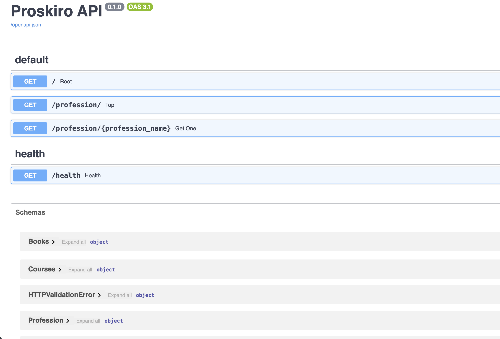</p>
<p align="center"><em>Auto-generated interactive API documentation, ready for partner integration.</em></p>

### 4. `django/` — the public website and growth engine
The face of Proskiro, and the largest application. It's a **Django + Wagtail** site that serves the
public profession pages and also runs the marketing side of the business:

- **CMS-driven content** — profession pages and persona-targeted landing pages are editable in Wagtail.
- **AI-written blog** — SEO articles are drafted by **Anthropic Claude** against a strict brand voice, rendered to HTML, and staged for review.
- **Lead-magnet funnel** — visitors request a personalised skills "roadmap" for a target job; the app builds a staged, email-ready plan and delivers it.
- **Email lifecycle & analytics** — automated follow-up sequences via **AWS SES**, with open/click tracking, attribution, and conversion reporting.

> **Built with AI-assisted development.** This application was developed with heavy use of AI coding
> tools (LLM pair-programming) throughout — architecture, implementation, tests, and docs — used
> deliberately to ship quickly while keeping the code reviewed, typed, linted, and tested. This is
> distinct from the AI *features* the product ships (Claude-generated content, AI images).

*Tech: Django 5, Wagtail CMS, Anthropic Claude, AWS SES & S3, Gunicorn, Docker.*

<p align="center">
  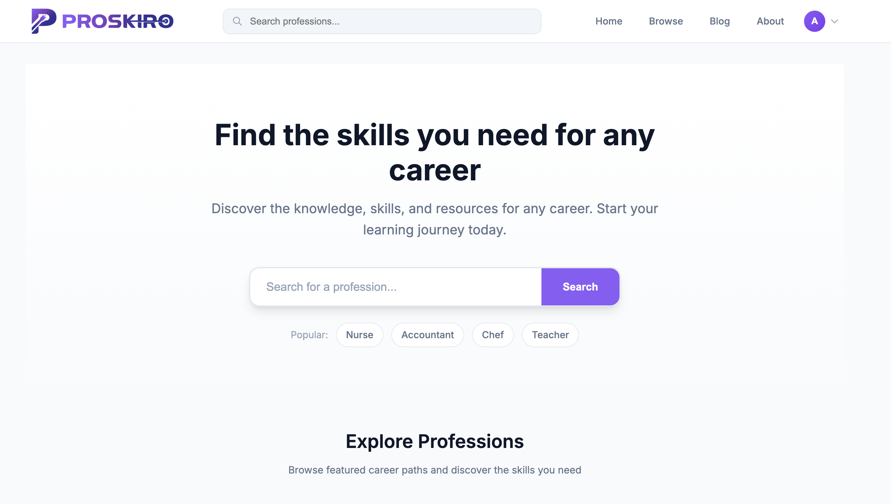
  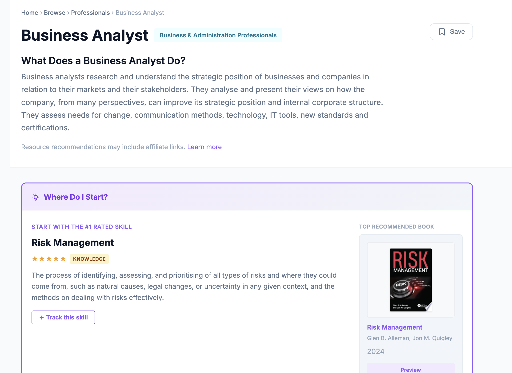
</p>
<p align="center"><em>The public homepage and a profession page — ranked, book-backed skills for a given career.</em></p>

<p align="center">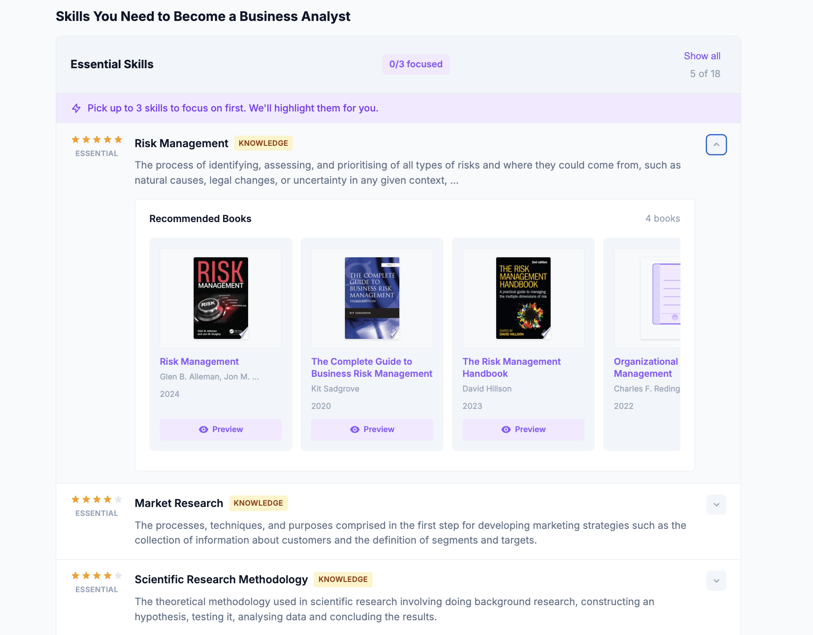</p>
<p align="center"><em>Drilling into a skill: star-rated importance and the AI-vetted books recommended for it.</em></p>

<p align="center">
  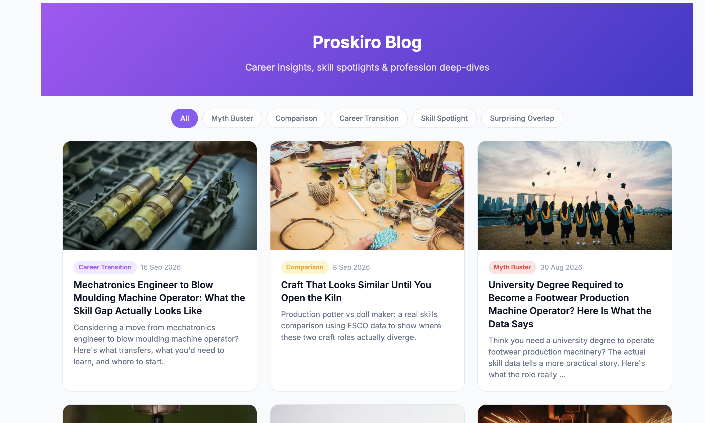
  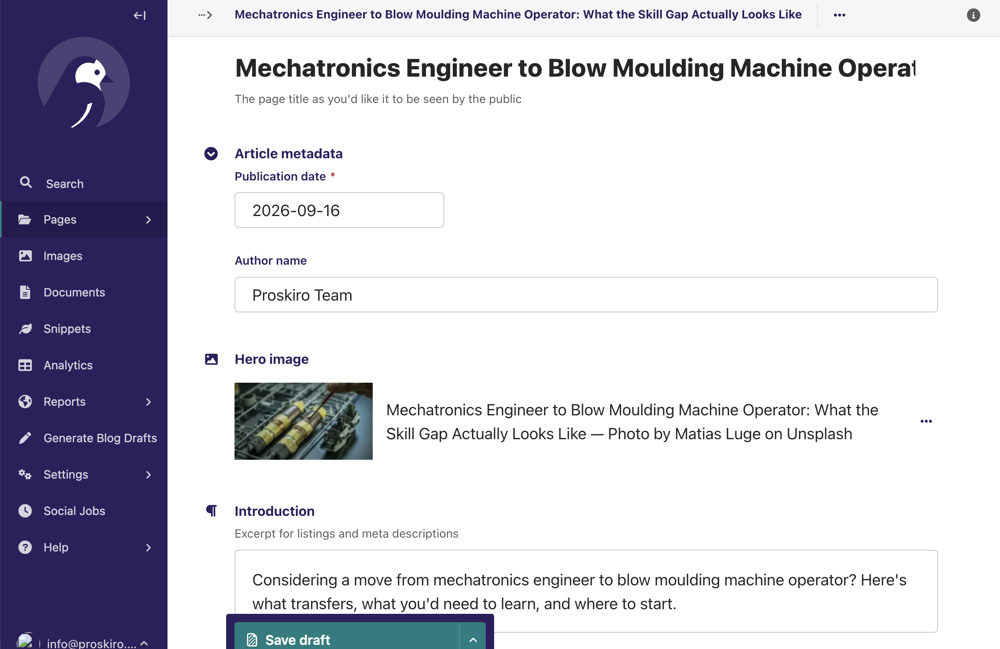
</p>
<p align="center"><em>The public blog, and the Wagtail editor where AI-drafted articles are reviewed before publishing.</em></p>

<p align="center">
  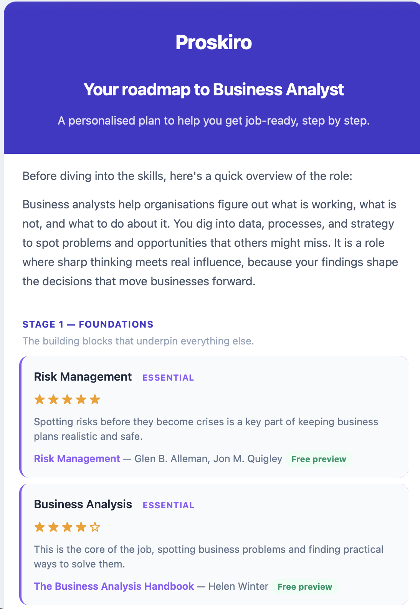
  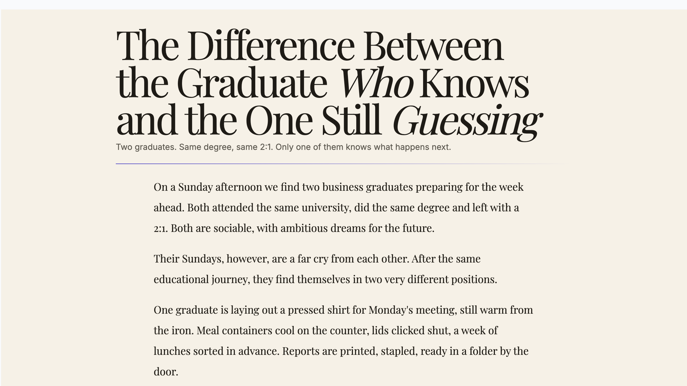
</p>
<p align="center"><em>The personalised roadmap a visitor receives, and the landing page that drives them into the funnel.</em></p>

<p align="center">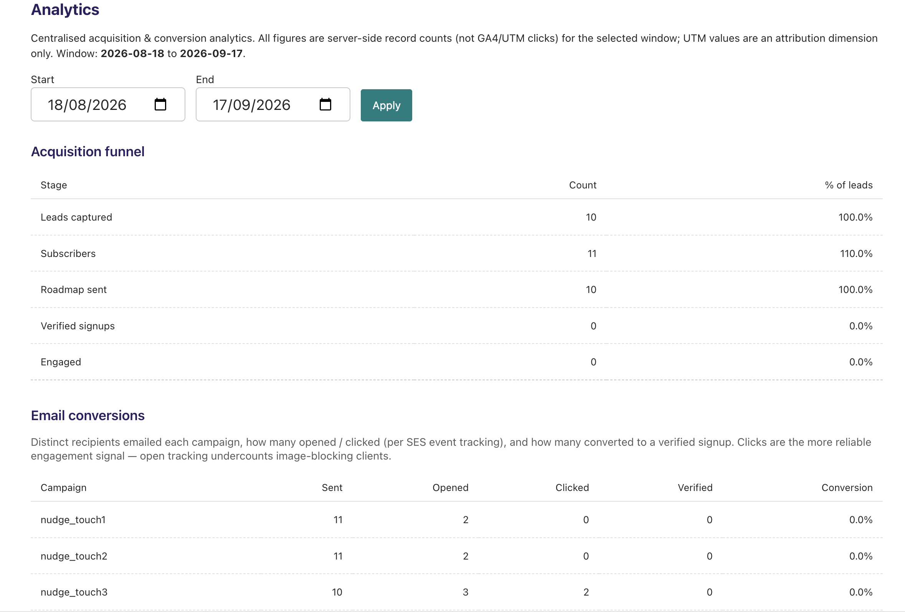</p>
<p align="center"><em>Email lifecycle analytics — open/click tracking and conversion attribution for the roadmap funnel.</em></p>

### 5. `infra/` — the infrastructure
**Terraform** infrastructure-as-code that provisions the entire AWS foundation the platform runs on,
split into separate `staging` and `production` environments with reusable modules. It's the layer
underneath every other project — nothing above it runs without it.

It provisions:

- **VPC & networking** — the private network the platform's cloud resources live in, with security groups controlling exactly what can talk to what.
- **RDS (PostgreSQL)** — the shared, private database behind `proskiro-tools`, `django`, and `skills-api`. Not publicly reachable; only trusted resources inside the VPC can connect.
- **ECS** — the container compute platform that runs the `django` application in production.
- **S3** — object storage for static assets and user/media uploads.
- **SES** — the email-sending infrastructure behind the roadmap delivery and lifecycle email sequences.
- **Secrets Manager** — secure storage for credentials and secrets, consumed by the application at runtime.

*Tech: Terraform, AWS (VPC, RDS, ECS, S3, SES, Secrets Manager).*

---

## Test coverage

Each project ships with its own automated test suite (unit tests, not requiring any live external
services), and `django` also runs its suite plus linting on every push via GitHub Actions.

<details>
<summary><strong>Test suite run</strong> (real local run across all three testable projects, click to expand)</summary>

```
proskiro-tools   pytest -v -m "not integration"
  50 passed, 5 deselected in 0.04s

skills           pytest -v
  20 passed in 0.16s

django           python manage.py test --verbosity=2
  Ran 272 tests in 19.204s
  OK
```

</details>

---

## How a request actually flows

0. **Underneath everything:** `infra` has already provisioned the VPC, RDS database, ECS compute, S3, SES, and secrets that the rest of the stack runs on.
1. **Offline:** the `skills` pipeline runs automatically on a schedule, populating PostgreSQL with professions, ranked skills, and AI-vetted book recommendations.
2. **A visitor** lands on a profession page on the `django` site (often via an AI-written blog article built for SEO).
3. `django` reads the profession and its skills through `proskiro-tools`, and renders the page.
4. The visitor requests a **personalised roadmap**; `django` builds it and sends it via **SES**, then runs a tracked follow-up email sequence.
5. Separately, **B2B partners** (a future expansion, not end users) can license the same data programmatically through the `skills-api` REST endpoints.

---

## Why it's built this way

- **Single source of truth** — one database and one shared data layer (`proskiro-tools`) means the API and website can never disagree about the data.
- **Separation of concerns** — batch data work, read API, and public web app are independent services that can be developed, tested, and deployed on their own.
- **AI where it adds real value** — semantic ranking for recommendations, taxonomy alignment, and brand-consistent content generation, rather than AI for its own sake.
- **Production-minded** — SSL database connections, connection pooling and resilience, containerised deployments, environment-split IaC, and email deliverability tracking.

---

## At a glance

| Project | Role | Core tech |
|---|---|---|
| `proskiro-tools` | Shared models, DB layer, queries | Pydantic v2, SQLAlchemy 2.0 |
| `skills` | Data pipeline (books + taxonomy), runs on an automated schedule | Scrapy, Cohere, Google Books / Open Library |
| `skills-api` | REST API over the data (B2B expansion, not consumer-facing) | FastAPI |
| `django` | Public site, CMS, AI blog, email funnel (AI-assisted build) | Django, Wagtail, Claude, AWS SES/S3 |
| `infra` | Provisions the AWS foundation (VPC, RDS, ECS, S3, SES, Secrets Manager) | Terraform, AWS |
